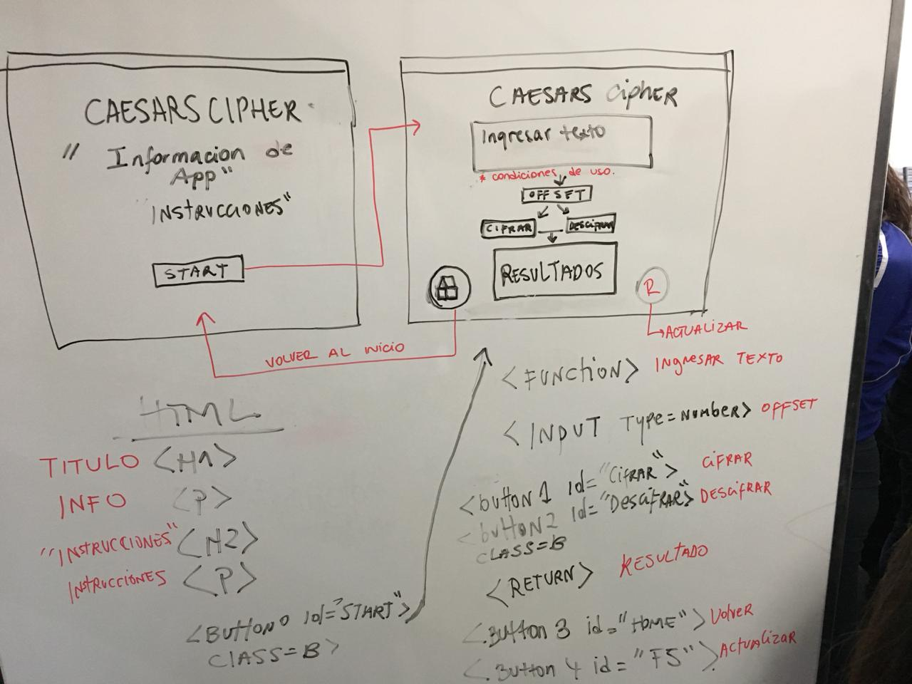
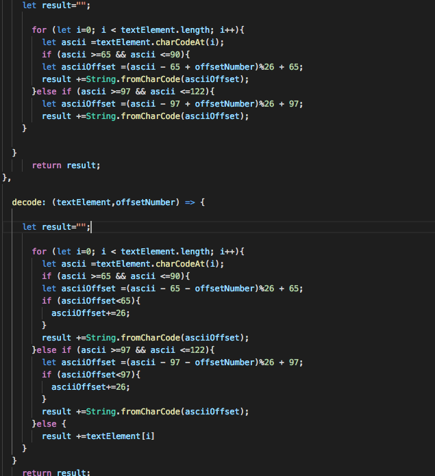
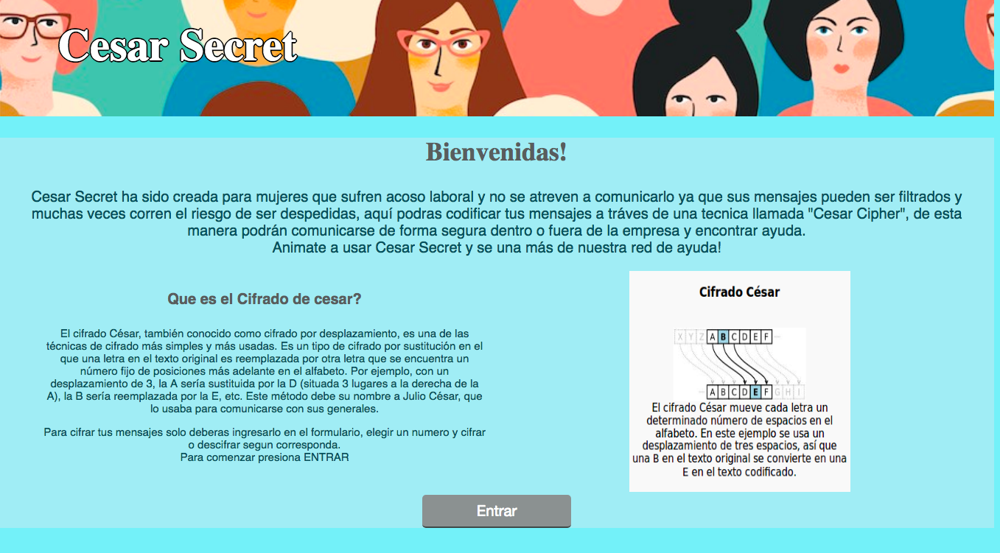
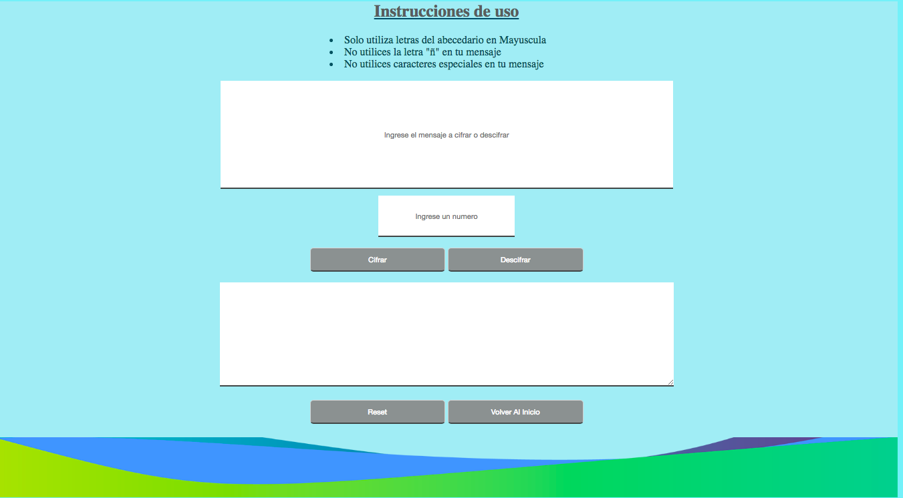
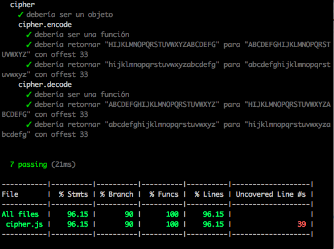

# Cesar Secret

Cesar Secret ha sido creada para mujeres entre los 18 y 60 años que esten trabajando, están mujeres sufren acoso laboral y no se atreven a comunicarlo ya que sus mensajes pueden ser filtrados y muchas veces corren el riesgo de ser despedidas.

En nuestro sitio podran codificar sus mensajes a tráves de una tecnica llamada "Cesar Cipher", de esta manera podrán comunicarse de forma segura dentro o fuera de la empresa y encontrar ayuda.

El cifrado césar es una de las técnicas más simples para cifrar un mensaje. Es un tipo de cifrado por sustitución, es decir que cada letra del texto original es reemplazada por otra que se encuentra un número fijo de posiciones (desplazamiento) más adelante en el mismo alfabeto.

Esta pagina podrás verla en el siguiente link:()

## Como utilizarlo:

- Para utilizarla primero te invitamos a leer la introducción que se encuentra en la primera pantalla de nuestra pagina web.
- Una vez que hayas leido debes presionar en boton de Entrar para ingresar al formulario donde podrás codificar tus mensajes.
- Una vez en el formulario encontraras unas breves instrucciones, te recomendamos leerlas y seguirlas para que no tengas problemas al codificar tus mensajes.
- Ahora Ingresa tu mensaje a Cifrar o descifrar
- Ingresa un número, el cual correspondera al numero de veces que quieres que se desplace la letra en el alfabeto.
- Presiona Cifrar o descifrar según corresponda
- Si has cifrado, copia el codigo y numero que has utilizado y ya podrás enviarlo.
- Si te han dado un codigo para descifrar, ingresalo como mensaje
- Ingresa el número que te han entregado que desplazara las letras del abecedario
- Y por último ve el resultado presionando descifrar.

## Historia de usuario

Este proyecto nacio de la necesidad de una usuaria llamada Renata Telias de 45 años, ella trabajaba en una empresa de construcción y fue acosada por el jefe a cargo de la Obra, tras resistirse varias veces y comunicar a su acosador el desagrado que ella sentia lo comunico a una compañera vía mail interno el cual fue leido por su agresor, lo único que logro fue un maltrato psicologico de parte de él y su posterior despido.

Para esto hemos creado esta plataforma en donde se podrán codificar mensajes y ser enviados de forma segura para comunicar este tipo de agresiones.

Luego de investigar se crea Cesar Secret, La idea es tener una pagina simple y de facíl acceso para codificar 
los mensajes.

## Consideraciones para el diseño

Se piensa en una pagina simple, dos pantallas.

La primera contendra la introduccion al sitio, una breve explicación de uso y significados. La segunda pantalla tendra algunas instrucciones y el formulario para codificar los mensajes.

Se diseña pensando en la simplicidad y el uso de este sitio, no debe ser demasiado complejo y así puedan utilizarlo rapida y facílmente.

Los colores claros y tenues para dar sensación de paz en un proceso que es bastante complejo.
La imagen del Header representa la unidad entre las mujeres que se brindan apoyo frente al acoso laboral.

Se comienza el proceso de diseño considerando lo anterior y una vez diseñada y con el formulario funcionando se realiza el primer testeo.

Aquí va una muestra del primer flujo y sus dos pantallas

## Testeo y consideraciones para hacer cambios y mejoras

Se hace una prueba con una usuaria, Francia de 18 años prueba la pagina y se encuentra con que es poco clara y no explica que significa codificar un mensaje, además en esta primera instancia, las instrucciones se encuentran en la pantalla principal, por lo cual, ella expresa la dificultad de que esto sea así y que estas debieran encontrarse en la pantalla donde debera ingresar los mensajes.

Luego de esto se considera lo siguiente:

- Luego de dar la bienvenida en la pagina, se hará un breve resumén de que trata nuestro sitio.
- Se hará una breve introduccion al significado del código cesar y como funciona nuestra pagina.
- Las instrucciones iran en la segunda pantalla, en la parte superior del formulario para codificar.
- Estás instrucciones solo harán referencia a la forma en que se ingresa el mensaje y cuales son las restricciones.
- Formulario simple y facíl de usar, se indica en las casillas cuales son los datos a ingresar.

## Resumén del código

El código creado para codificar los mensajes, es una formula que permite cifrar y descifrar, esto a tráves del desplazamiento de las letras del abecedario, este código a sido programado con javascript y nos permitira tener el resultado esperado y cumplir con el objetivo del sitio.

## Planificación 

En el siguiente link se podrá ver la planificación del proyecto

https://trello.com/b/zU5Khtxl/cifrado-de-mensajes

## Resultado final

### Primera pantalla

### Segunda pantalla

## Test Realizados

